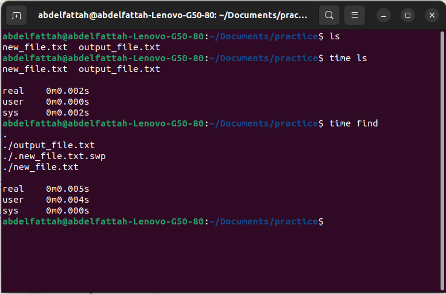
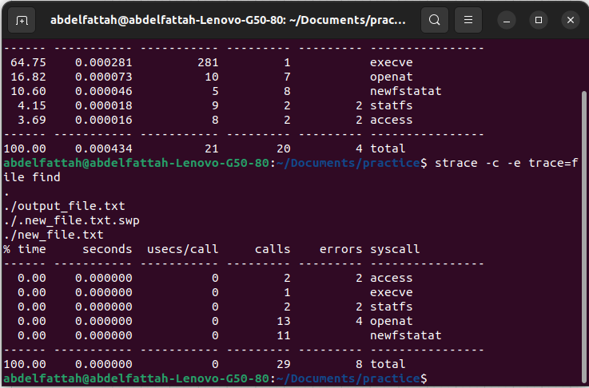
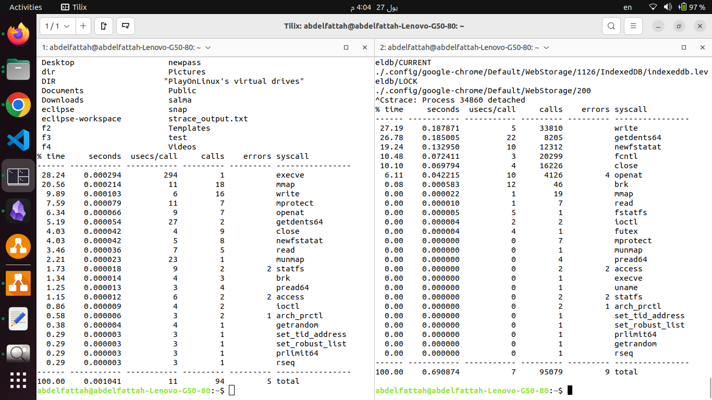

<h1>Use Case</h1>
<h3>1. ls vs find</h3>
<h4>a. time measurement</h4>

- <strong>real:</strong> Total elapsed time from start to finish, including system calls and waiting for other processes.

- <strong>user:</strong> CPU time spent in the user space of the process.

- <strong>sys:</strong> CPU time spent in the kernel on behalf of the process.

  > $ time "command"

<h4>b. System Interaction Identification:</h4>

- Identifying potential system stack interactions for a command is a valuable step in understanding its behavior and potential performance implications.

 - <strong>ls:</strong> File System Stack

- <strong>find:</strong> File System Stack

  > $ strace -c -e trace=file "command"

<h4>c. Syscall Time Breakdown :</h4>

 - <strong>ls:</strong> 0.001041

- <strong>find:</strong> 0.690874

  > $ strace -c "command"

  
  

<h4>d. Performance Evaluation :</h4>

- <strong>ls</strong> is better than <strong>find</strong>

