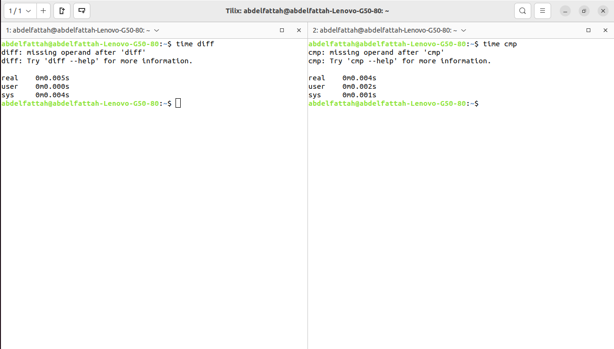
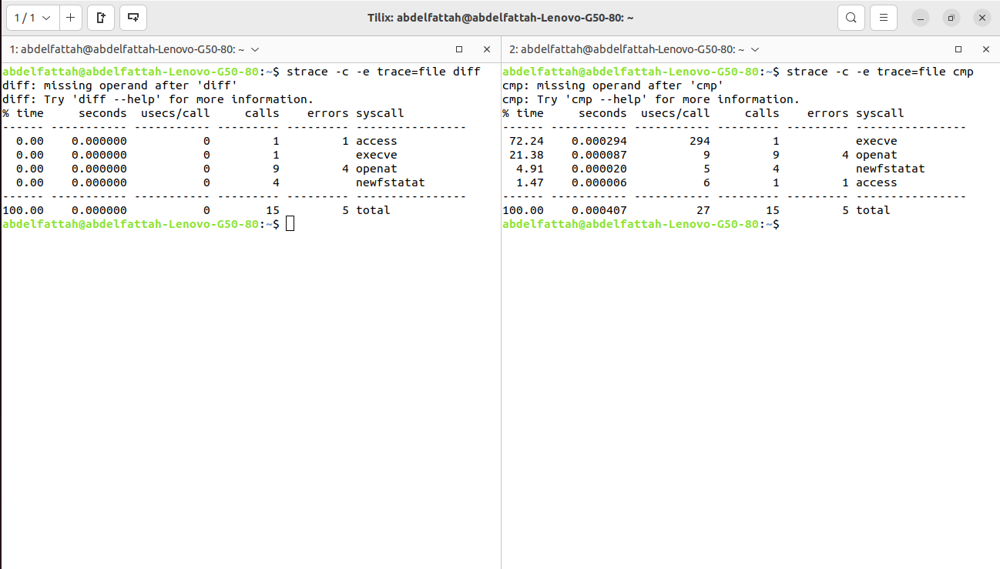
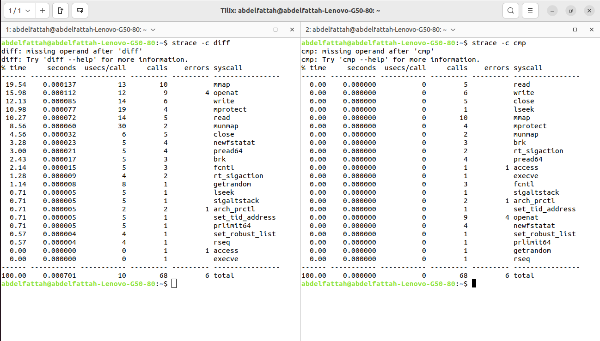

<h1>Use Case</h1>
<h3>1. ls VS. find</h3>
<h4>a. time measurement</h4>

- <strong>real:</strong> Total elapsed time from start to finish, including system calls and waiting for other processes.

- <strong>user:</strong> CPU time spent in the user space of the process.

- <strong>sys:</strong> CPU time spent in the kernel on behalf of the process.

  > $ time "command"

<h4>b. System Interaction Identification:</h4>

- Identifying potential system stack interactions for a command is a valuable step in understanding its behavior and potential performance implications.

 - <strong>ls:</strong> File System Stack

- <strong>find:</strong> File System Stack

  > $ strace -c -e trace=file "command"

<h4>c. Syscall Time Breakdown :</h4>

 - <strong>ls:</strong> 0.001041 s

- <strong>find:</strong> 0.690874 s

  > $ strace -c "command"

  
  

<h4>d. Performance Evaluation :</h4>

- <strong>ls</strong> is better than <strong>find</strong>

---------------------------------------------------------

<h3>2. cp VS. rsync</h3>

- cp: Use for simple, straightforward copying tasks where you do not need incremental copying,
remote synchronization, or advanced options.

- rsync: Use for tasks requiring efficient file synchronization, remote copying, incremental updates, and advanced features like resuming transfers and deleting extra files.

<h4>a. time measurement</h4>

 > $ time "command"

<h4>b. System Interaction Identification:</h4>

 - <strong>cp:</strong> File System Stack

- <strong>rsync:</strong> File System Stack 

> $ strace -c -e trace=file "command"

<h4>c. Syscall Time Breakdown :</h4>

 - <strong>cp:</strong> 0.001150 s

- <strong>find:</strong> 0.001281 s

> $ strace -c "command"

  

  <h4>d. Performance Evaluation :</h4>

- <strong>cp</strong> is better than <strong>rsync</strong>

---------------------------------------------------------

<h3>3. diff VS. cmp</h3>

<h4>a. time measurement</h4>

 > $ time "command"

<h4>b. System Interaction Identification:</h4>

 - <strong>diff:</strong> File System Stack

- <strong>cmp:</strong> File System Stack 

> $ strace -c -e trace=file "command"

<h4>c. Syscall Time Breakdown :</h4>

 - <strong>diff:</strong> 0.000701 s

- <strong>cmp:</strong> 0.000000 s

> $ strace -c "command"

  

  <h4>d. Performance Evaluation :</h4>

- <strong>cmp</strong> is better than <strong>diff</strong>

---------------------------------------------------------

