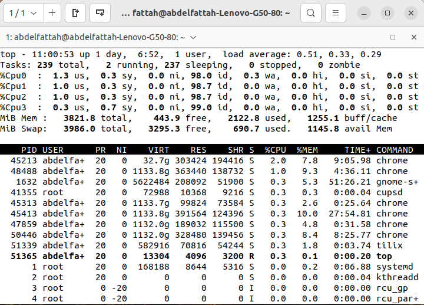
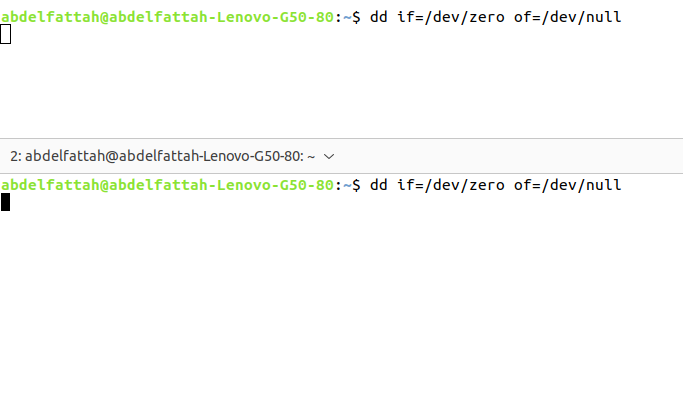
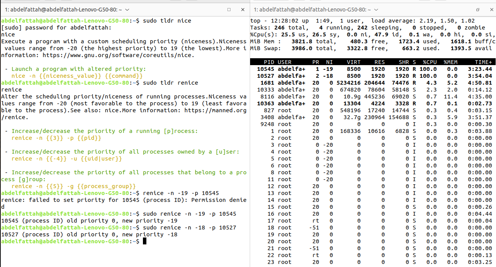
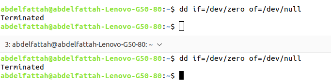

<h1> TASK (A) </h1>
<h3>Assignment one for kernel module :</h3>
 <h5>1. Check how many cores do you have using top command.</h5>
 
<strong>answer:</strong>

> $ top

Then,press <strong>1</strong> in keyboard

 <h5>2. Create number of cores + 2 processes dd if=/dev/zero of=/dev/null run in background.</h5>

<strong>answer:</strong>

write the commmand twice in terminal.
> $ dd if=/dev/zero of=/dev/null

 <h5>3. Change priority for them:
-20, -10, 0, .. , 19.</h5>

<strong>answer:</strong>

> $ sudo renice -n {priority} -p {PID}

 <h5>4. Monitor them using top command, did you notice any change ?</h5>

 <strong>answer:</strong>

priority is changed!

 <h5>5. Kill them all using killall command.</h5>

 > $ sudo killall dd

all process are terminalted

