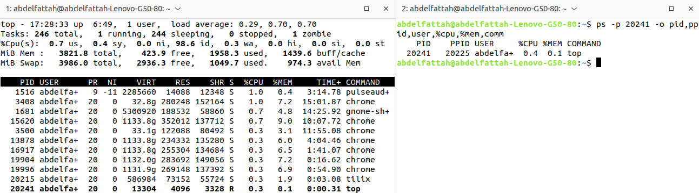
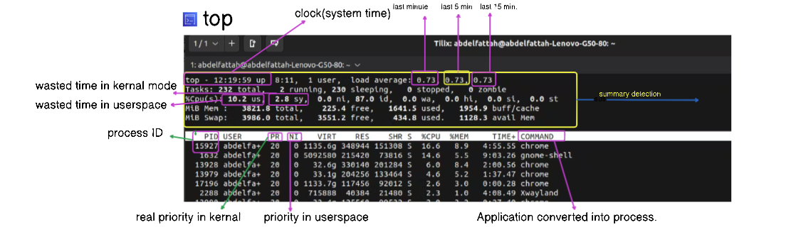

<h1> TASK (B) </h1>

<h3>Assignment two for kernel module :</h3>
 <h4>Show all of the following : </h4>
 <h5>1. Process Information:</h5>
Provide detailed information about a specific process, including its PID, parent process ID, user, CPU and memory usage, etc.

 <strong>answer:</strong>

> $ ps -p <PID> -o pid,ppid,user,%cpu,%mem,comm

 <h5>2. Kill a Process:</h5>
 Allow users to terminate a specific process by entering its PID.

 

<strong>answer:</strong>

> $ sudo kill {PID}

<h5>3. Process Statistics:</h5>
Display overall system process statistics, such as the total number of processes, memory usage, and CPU load.

<strong>answer:</strong>

> $ top

<h5>4. Real-time Monitoring:</h5>
Implement real-time monitoring, updating the display at regular intervals to show the latest process information.

<strong>answer:</strong>

> $ top

<h5>5. Search and Filter:</h5>
Allow users to search for processes based on criteria such as name, user, or resource usage.

<strong>answer:</strong>

<h6>Filter by Process Name</h6>

- Press o (the letter 'o').

- Type COMMAND=<process_name> and press Enter. Replace <process_name> with the name of the process you want to filter by.  FOR EXAMPLE.

> $ COMMAND=python

 
<h6>Filter by User</h6>

- Press o (the letter 'o').

- Type USER=<username> and press Enter. Replace <username> with the name of the user whose processes you want to filter by.FOR EXAMPLE.

> $ USER=user123

 
<h6>Filter by CPU Usage</h6>

- Press o (the letter 'o').

- ype %CPU>10 and press Enter to filter for processes using more than 10% CPU. You can replace 10 with any other value as needed.FOR EXAMPLE. 

> $ %CPU>10

<h6>Filter by Memory Usage</h6>

- Press o (the letter 'o').

- Type %MEM>5 and press Enter to filter for processes using more than 5% memory. You can replace 5 with any other value as needed. FOR EXAMPLE.

> $ %MEM>5

<h6>Reset Filters</h6>

- To reset and remove all filters, press =.

