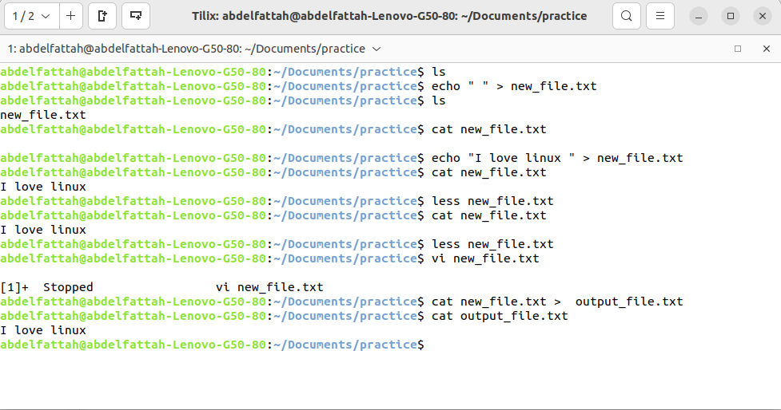

<h1> TASK (A) </h1>

<h2>commands-f:</h2>

<h3>Exercise 1: Basic Navigation </h3>

- Use ls to list all files and directories in the current directory.
- Use cd to navigate to a specific directory.
- Use pwd to print the current working directory.

<strong>answer:</strong>

-------------------------------------------

<h3>Exercise 2: File and Directory Operations</h3>

- Create a directory named "practice" in the current directory using mkdir.
- Create an empty file named "file.txt" within the "practice" directory using touch.
- Copy "file.txt" to a new file "file_backup.txt" using cp.
- Move "file_backup.txt" to another directory using mv.
- Rename "file.txt" to "new_file.txt" using mv.
- Delete the "new_file.txt" using rm.

<strong>answer:</strong>

-------------------------------------------

<h3>Exercise 3: File Viewing and Editing</h3>

- Create a text file using echo or a text editor like nano.
- View the contents of the file using cat.
- View the contents of the file using less.
- Edit the file using nano or another text editor.
- Redirect the output of a command (e.g., ls) to a file using >.
  
<strong>answer:</strong>

-------------------------------------------

