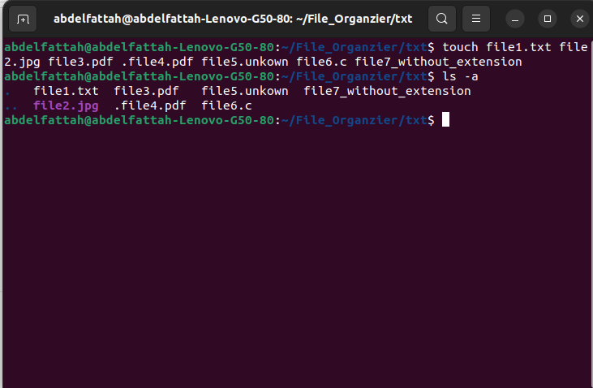
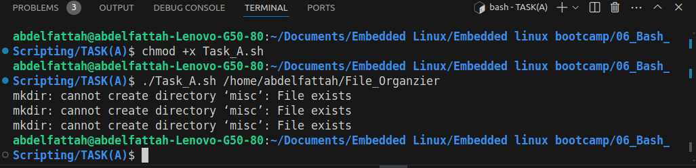
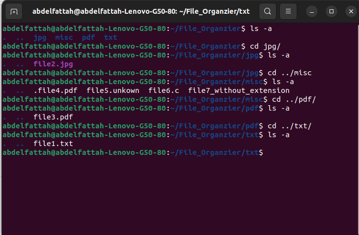

# File Organizer

## Project Idea: File Organizer

The goal of this project is to create a Bash script that organizes files in a specified directory based on their file types into separate subdirectories. This can be useful to keep your directories clean and tidy by automatically sorting files into appropriate categories.

## Features

- The script takes a directory path as an argument and organizes the files within that directory.
- It creates subdirectories based on the file extensions (e.g., "txt" for text files, "jpg" for image files).
- Files with unknown or no file extensions are placed in a "misc" subdirectory.
- If a subdirectory for a particular file type already exists, the script moves the files into that existing directory.
- The script handles edge cases, such as files with no extensions or hidden files (those starting with a dot).

## Example

Suppose you have a directory called "Downloads" with the following files:

- `file1.txt`
- `file2.jpg`
- `file3.pdf`
- `file5_without_extension`
- `file6.unknown`

<h4>Answer:</h4>

look at the file Task_A.sh

you should put the path of the directory with execute the script

> $ ./Task_A.sh {path/to/directory}

- Create different file types.

- Execute script file.

- Directory become organized

- Final Result

