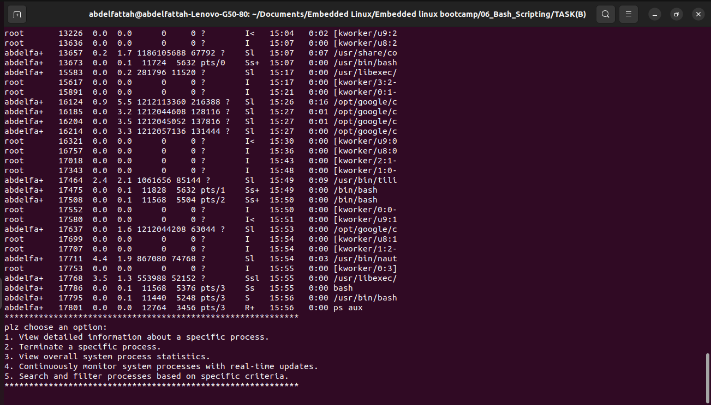

# Porject: Process Monitor - Bash Script

## Project Overview

The **Process Monitor** is a Bash script designed to provide a simple yet powerful way to view, manage, and analyze running processes on Unix-like systems. The script is designed to be user-friendly, offering interactive options to monitor processes in real-time, set resource usage alerts, log process activities, and more.

## Features

### 1. List Running Processes
The script includes functionality to list all running processes along with essential information such as:

- Process ID (PID)
- Process name
- CPU usage
- Memory usage

### 2. Process Information
The script allows users to retrieve detailed information about a specific process, including:

- PID
- Parent Process ID (PPID)
- User running the process
- CPU usage percentage
- Memory usage in kilobytes
- Command used to start the process

### 3. Kill a Process
Users can terminate a specific process by entering its PID. The script provides feedback on whether the termination was successful.

### 4. Process Statistics
The script can display overall system process statistics, such as:

- Total number of running processes
- Total memory usage
- CPU load average

### 5. Real-time Monitoring
The script includes a real-time monitoring feature that continuously updates the display to show the latest process information.

### 6. Search and Filter Processes
Users can search for and filter processes based on various criteria, including:

- Process name
- User running the process
- CPU usage threshold
- Memory usage threshold

### 7. Interactive Mode
The script offers an interactive mode where users can choose from a menu of operations, such as viewing process details, terminating processes, and more.

### 8. Resource Usage Alerts
The script allows users to set up alerts for processes that exceed predefined CPU and memory usage thresholds. When a threshold is exceeded, an alert message is logged.

### 9. Logging
All significant process-related activities, such as process terminations and resource usage alerts, are logged into a log file. This allows for easy tracking and auditing of events.

### 10. Configuration Options
Users can configure the script through a configuration file (`ProcessMonitor.cfg`). This file allows users to customize settings such as:

- Update interval for real-time monitoring
- CPU usage alert threshold
- Memory usage alert threshold

## Configuration File

A sample configuration file (`ProcessMonitor.cfg`) might look like this:

```bash
# Sample configuration file for Process Monitor

# Update interval in seconds
UPDATE_INTERVAL=5

# CPU usage threshold for alerts (percentage)
CPU_ALERT_THRESHOLD=90

# Memory usage threshold for alerts (in kilobytes)
MEMORY_ALERT_THRESHOLD=80
```



